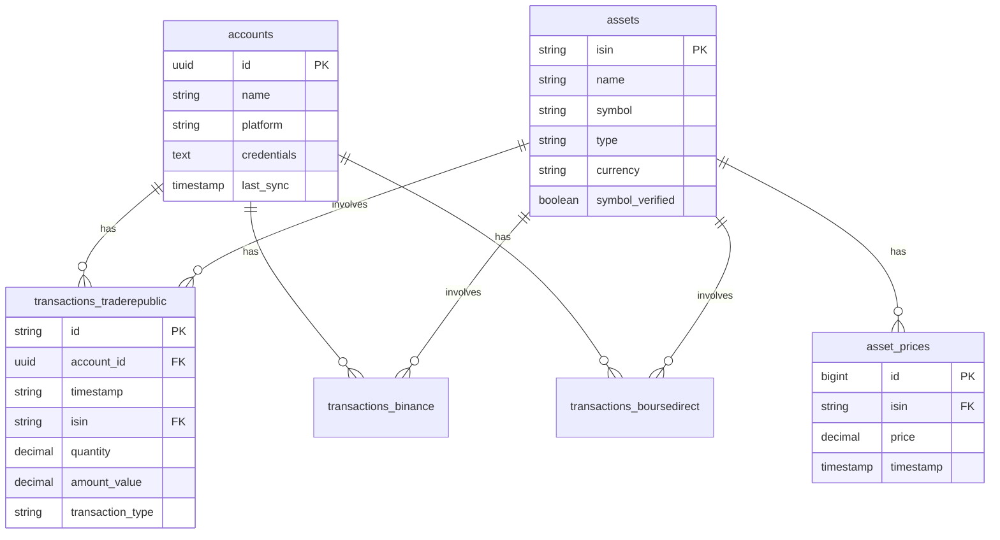

# Schéma de Base de Données - Valhafin

Documentation complète du schéma PostgreSQL de Valhafin.

## 📊 Vue d'Ensemble

Valhafin utilise PostgreSQL 15+ avec **7 tables principales** organisées autour de 4 concepts clés :
1. **Comptes financiers** - Connexions aux plateformes d'investissement
2. **Actifs** - Actions, ETF, cryptomonnaies
3. **Prix** - Historique des prix des actifs
4. **Transactions** - Opérations financières par plateforme

## 🗂️ Liste des Tables

| Table | Lignes (approx.) | Utilité |
|-------|------------------|---------|
| `accounts` | ~10 | Comptes connectés (Trade Republic, Binance, etc.) |
| `assets` | ~100-1000 | Actifs financiers (actions, ETF, crypto) |
| `asset_prices` | ~10,000+ | Historique des prix des actifs |
| `transactions_traderepublic` | ~1,000+ | Transactions Trade Republic |
| `transactions_binance` | ~1,000+ | Transactions Binance |
| `transactions_boursedirect` | ~1,000+ | Transactions Bourse Direct |
| `schema_migrations` | ~10 | Suivi des migrations de schéma |

---

## 📋 Tables Détaillées

### 1. `accounts` - Comptes Financiers

**Utilité:** Stocke les comptes connectés aux différentes plateformes d'investissement.

**Schéma:**
```sql
CREATE TABLE accounts (
    id UUID PRIMARY KEY DEFAULT gen_random_uuid(),
    name VARCHAR(255) NOT NULL,
    platform VARCHAR(50) NOT NULL,
    credentials TEXT NOT NULL,
    created_at TIMESTAMP DEFAULT CURRENT_TIMESTAMP,
    updated_at TIMESTAMP DEFAULT CURRENT_TIMESTAMP,
    last_sync TIMESTAMP
);

CREATE INDEX idx_accounts_platform ON accounts(platform);
```

**Colonnes:**

| Colonne | Type | Description |
|---------|------|-------------|
| `id` | UUID | Identifiant unique du compte |
| `name` | VARCHAR(255) | Nom donné par l'utilisateur (ex: "Mon Trade Republic") |
| `platform` | VARCHAR(50) | Plateforme: `traderepublic`, `binance`, `boursedirect` |
| `credentials` | TEXT | Credentials chiffrés avec AES-256-GCM (JSON) |
| `created_at` | TIMESTAMP | Date de création du compte |
| `updated_at` | TIMESTAMP | Date de dernière modification |
| `last_sync` | TIMESTAMP | Date de dernière synchronisation |

**Index:**
- `idx_accounts_platform` - Recherche rapide par plateforme

**Relations:**
- **1 → N** avec `transactions_*` (un compte a plusieurs transactions)

**Sécurité:**
- ⚠️ Les `credentials` sont **chiffrés** avant stockage
- Jamais exposés en clair dans l'API (tag JSON `json:"-"`)

**Exemple de données:**
```json
{
  "id": "550e8400-e29b-41d4-a716-446655440000",
  "name": "Mon Trade Republic",
  "platform": "traderepublic",
  "credentials": "encrypted_base64_string...",
  "created_at": "2024-01-01T10:00:00Z",
  "last_sync": "2024-02-10T15:30:00Z"
}
```

---

### 2. `assets` - Actifs Financiers

**Utilité:** Catalogue de tous les actifs financiers (actions, ETF, cryptomonnaies) identifiés par leur ISIN.

**Schéma:**
```sql
CREATE TABLE assets (
    isin VARCHAR(12) PRIMARY KEY,
    name VARCHAR(255) NOT NULL,
    symbol VARCHAR(20),
    type VARCHAR(20) NOT NULL,
    currency VARCHAR(3) NOT NULL,
    last_updated TIMESTAMP DEFAULT CURRENT_TIMESTAMP,
    symbol_verified BOOLEAN DEFAULT FALSE
);

CREATE INDEX idx_assets_type ON assets(type);
CREATE INDEX idx_assets_symbol ON assets(symbol);
CREATE INDEX idx_assets_symbol_verified ON assets(symbol_verified);
```

**Colonnes:**

| Colonne | Type | Description |
|---------|------|-------------|
| `isin` | VARCHAR(12) | Code ISIN (clé primaire) - ex: `IE00B4ND3602` |
| `name` | VARCHAR(255) | Nom de l'actif - ex: "Physical Gold USD (Acc)" |
| `symbol` | VARCHAR(20) | Symbole boursier - ex: `IGLN.L`, `AAPL` |
| `type` | VARCHAR(20) | Type: `stock`, `etf`, `crypto` |
| `currency` | VARCHAR(3) | Devise - ex: `EUR`, `USD`, `GBP` |
| `last_updated` | TIMESTAMP | Date de dernière mise à jour |
| `symbol_verified` | BOOLEAN | Symbole vérifié manuellement ou automatiquement |

**Index:**
- `idx_assets_type` - Filtrage par type d'actif
- `idx_assets_symbol` - Recherche par symbole
- `idx_assets_symbol_verified` - Filtrage des symboles non vérifiés

**Relations:**
- **1 → N** avec `asset_prices` (un actif a plusieurs prix historiques)
- **1 → N** avec `transactions_*` (un actif apparaît dans plusieurs transactions)

**Exemple de données:**
```json
{
  "isin": "IE00B4ND3602",
  "name": "iShares Physical Gold ETC",
  "symbol": "IGLN.L",
  "type": "etf",
  "currency": "EUR",
  "symbol_verified": true
}
```

---

### 3. `asset_prices` - Historique des Prix

**Utilité:** Stocke l'historique des prix des actifs récupérés depuis Yahoo Finance pour calculer les performances.

**Schéma:**
```sql
CREATE TABLE asset_prices (
    id BIGSERIAL PRIMARY KEY,
    isin VARCHAR(12) REFERENCES assets(isin) ON DELETE CASCADE,
    price DECIMAL(20, 8) NOT NULL,
    currency VARCHAR(3) NOT NULL,
    timestamp TIMESTAMP NOT NULL,
    UNIQUE(isin, timestamp)
);

CREATE INDEX idx_asset_prices_isin_timestamp ON asset_prices(isin, timestamp DESC);
```

**Colonnes:**

| Colonne | Type | Description |
|---------|------|-------------|
| `id` | BIGSERIAL | Identifiant unique auto-incrémenté |
| `isin` | VARCHAR(12) | Référence vers `assets.isin` |
| `price` | DECIMAL(20, 8) | Prix de l'actif (haute précision) |
| `currency` | VARCHAR(3) | Devise du prix |
| `timestamp` | TIMESTAMP | Date et heure du prix |

**Contraintes:**
- `UNIQUE(isin, timestamp)` - Un seul prix par actif par timestamp
- `ON DELETE CASCADE` - Suppression automatique si l'actif est supprimé

**Index:**
- `idx_asset_prices_isin_timestamp` - Requêtes d'historique optimisées (DESC pour les prix récents)

**Relations:**
- **N → 1** avec `assets` (plusieurs prix pour un actif)

**Fréquence de mise à jour:**
- Automatique via scheduler (horaire ou quotidienne)
- Manuelle via API `/api/assets/{isin}/price/refresh`

**Exemple de données:**
```json
{
  "id": 12345,
  "isin": "IE00B4ND3602",
  "price": 77.71,
  "currency": "EUR",
  "timestamp": "2024-02-10T15:00:00Z"
}
```

---

### 4. `transactions_traderepublic` - Transactions Trade Republic

**Utilité:** Stocke toutes les transactions récupérées depuis Trade Republic (achats, ventes, dividendes, frais).

**Schéma:**
```sql
CREATE TABLE transactions_traderepublic (
    id VARCHAR(255) PRIMARY KEY,
    account_id UUID REFERENCES accounts(id) ON DELETE CASCADE,
    timestamp VARCHAR(255) NOT NULL,
    title VARCHAR(255),
    icon VARCHAR(255),
    avatar VARCHAR(255),
    subtitle VARCHAR(255),
    amount_currency VARCHAR(3),
    amount_value DECIMAL(20, 8),
    amount_fraction INT,
    status VARCHAR(50),
    action_type VARCHAR(50),
    action_payload TEXT,
    cash_account_number VARCHAR(255),
    hidden BOOLEAN DEFAULT FALSE,
    deleted BOOLEAN DEFAULT FALSE,
    actions TEXT,
    dividend_per_share VARCHAR(255),
    taxes VARCHAR(255),
    total VARCHAR(255),
    shares VARCHAR(255),
    share_price VARCHAR(255),
    fees VARCHAR(255),
    amount VARCHAR(255),
    isin VARCHAR(12) REFERENCES assets(isin),
    quantity DECIMAL(20, 8),
    transaction_type VARCHAR(50),
    metadata JSONB
);

CREATE INDEX idx_transactions_tr_account ON transactions_traderepublic(account_id);
CREATE INDEX idx_transactions_tr_timestamp ON transactions_traderepublic(timestamp DESC);
CREATE INDEX idx_transactions_tr_isin ON transactions_traderepublic(isin);
CREATE INDEX idx_transactions_tr_type ON transactions_traderepublic(transaction_type);
```

**Colonnes Principales:**

| Colonne | Type | Description |
|---------|------|-------------|
| `id` | VARCHAR(255) | ID unique de la transaction (fourni par Trade Republic) |
| `account_id` | UUID | Référence vers `accounts.id` |
| `timestamp` | VARCHAR(255) | Date/heure de la transaction |
| `title` | VARCHAR(255) | Titre de la transaction |
| `subtitle` | VARCHAR(255) | Sous-titre (détails) |
| `amount_value` | DECIMAL(20, 8) | Montant de la transaction |
| `amount_currency` | VARCHAR(3) | Devise |
| `isin` | VARCHAR(12) | Référence vers `assets.isin` |
| `quantity` | DECIMAL(20, 8) | Quantité achetée/vendue |
| `transaction_type` | VARCHAR(50) | Type: `buy`, `sell`, `dividend`, `fee` |
| `fees` | VARCHAR(255) | Frais de transaction |
| `status` | VARCHAR(50) | Statut: `completed`, `pending`, `cancelled` |
| `metadata` | JSONB | Données supplémentaires spécifiques à Trade Republic |

**Contraintes:**
- `ON DELETE CASCADE` - Suppression automatique si le compte est supprimé

**Index:**
- `idx_transactions_tr_account` - Filtrage par compte
- `idx_transactions_tr_timestamp` - Tri chronologique (DESC pour les plus récentes)
- `idx_transactions_tr_isin` - Filtrage par actif
- `idx_transactions_tr_type` - Filtrage par type de transaction

**Relations:**
- **N → 1** avec `accounts` (plusieurs transactions pour un compte)
- **N → 1** avec `assets` (plusieurs transactions pour un actif)

**Types de transactions:**
- `buy` - Achat d'actif
- `sell` - Vente d'actif
- `dividend` - Dividende reçu
- `fee` - Frais
- `transfer` - Transfert de fonds
- `interest` - Intérêts

---

### 5. `transactions_binance` - Transactions Binance

**Utilité:** Stocke les transactions récupérées depuis Binance (cryptomonnaies).

**Schéma:** Identique à `transactions_traderepublic` avec les mêmes colonnes et index.

**Spécificités Binance:**
- Principalement des transactions crypto
- Peut inclure des staking rewards
- Frais en crypto (ex: BNB)

**Index:**
- `idx_transactions_bn_account`
- `idx_transactions_bn_timestamp`
- `idx_transactions_bn_isin`
- `idx_transactions_bn_type`

---

### 6. `transactions_boursedirect` - Transactions Bourse Direct

**Utilité:** Stocke les transactions récupérées depuis Bourse Direct (actions françaises et européennes).

**Schéma:** Identique à `transactions_traderepublic` avec les mêmes colonnes et index.

**Spécificités Bourse Direct:**
- Actions françaises et européennes
- Frais de courtage français
- Peut inclure des PEA/PEA-PME

**Index:**
- `idx_transactions_bd_account`
- `idx_transactions_bd_timestamp`
- `idx_transactions_bd_isin`
- `idx_transactions_bd_type`

---

### 7. `schema_migrations` - Suivi des Migrations

**Utilité:** Table système pour suivre les migrations de schéma appliquées.

**Schéma:**
```sql
CREATE TABLE schema_migrations (
    version INT PRIMARY KEY,
    name VARCHAR(255) NOT NULL,
    applied_at TIMESTAMP DEFAULT CURRENT_TIMESTAMP
);
```

**Colonnes:**

| Colonne | Type | Description |
|---------|------|-------------|
| `version` | INT | Numéro de version de la migration |
| `name` | VARCHAR(255) | Nom descriptif de la migration |
| `applied_at` | TIMESTAMP | Date d'application de la migration |

**Utilité:**
- Évite de ré-exécuter les migrations déjà appliquées
- Permet le rollback des migrations
- Historique des changements de schéma

**Exemple de données:**
```sql
version | name                              | applied_at
--------|-----------------------------------|-------------------
1       | create_accounts_table             | 2024-01-01 10:00:00
2       | create_assets_table               | 2024-01-01 10:00:01
3       | create_asset_prices_table         | 2024-01-01 10:00:02
8       | add_symbol_verified_to_assets     | 2024-02-10 15:00:00
```

---

## 🔗 Relations entre Tables



## 📊 Statistiques et Performance

### Volumétrie Estimée

| Table | Croissance | Taille après 1 an |
|-------|------------|-------------------|
| `accounts` | Stable | ~10 lignes |
| `assets` | Lente | ~500 lignes |
| `asset_prices` | Rapide | ~180,000 lignes (500 actifs × 365 jours) |
| `transactions_*` | Moyenne | ~5,000 lignes par plateforme |

### Index Critiques

Les index suivants sont essentiels pour les performances :

1. **`idx_asset_prices_isin_timestamp`** - Graphiques de performance
2. **`idx_transactions_*_account`** - Liste des transactions par compte
3. **`idx_transactions_*_timestamp`** - Tri chronologique
4. **`idx_transactions_*_isin`** - Performance par actif

### Requêtes Fréquentes

```sql
-- Performance globale (utilise tous les index de transactions)
SELECT SUM(amount_value) FROM transactions_traderepublic 
WHERE transaction_type = 'buy';

-- Historique des prix (utilise idx_asset_prices_isin_timestamp)
SELECT price, timestamp FROM asset_prices 
WHERE isin = 'IE00B4ND3602' 
ORDER BY timestamp DESC LIMIT 365;

-- Transactions récentes (utilise idx_transactions_*_timestamp)
SELECT * FROM transactions_traderepublic 
ORDER BY timestamp DESC LIMIT 50;
```

## 🔒 Sécurité

### Données Sensibles

| Table | Colonne | Protection |
|-------|---------|------------|
| `accounts` | `credentials` | ✅ Chiffrement AES-256-GCM |
| `transactions_*` | Toutes | ✅ Suppression en cascade si compte supprimé |

### Cascade Deletes

- Supprimer un **compte** → supprime toutes ses **transactions**
- Supprimer un **actif** → supprime tous ses **prix**

### Permissions PostgreSQL

```sql
-- Utilisateur applicatif (valhafin)
GRANT SELECT, INSERT, UPDATE, DELETE ON ALL TABLES TO valhafin;
GRANT USAGE, SELECT ON ALL SEQUENCES TO valhafin;
```

## 🛠️ Maintenance

### Commandes Utiles

```bash
# Se connecter à la base de données
docker exec -it valhafin-postgres-dev psql -U valhafin -d valhafin_dev

# Lister les tables
\dt

# Voir le schéma d'une table
\d accounts

# Compter les lignes
SELECT COUNT(*) FROM transactions_traderepublic;

# Voir les migrations appliquées
SELECT * FROM schema_migrations ORDER BY version;

# Taille des tables
SELECT 
    schemaname,
    tablename,
    pg_size_pretty(pg_total_relation_size(schemaname||'.'||tablename)) AS size
FROM pg_tables
WHERE schemaname = 'public'
ORDER BY pg_total_relation_size(schemaname||'.'||tablename) DESC;
```

### Backup

```bash
# Backup complet
docker exec valhafin-postgres-dev pg_dump -U valhafin valhafin_dev > backup.sql

# Restore
docker exec -i valhafin-postgres-dev psql -U valhafin valhafin_dev < backup.sql
```

---

**Dernière mise à jour:** 2024-02-10
